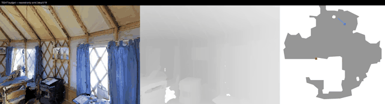
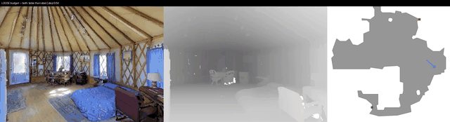

# Multi-goal episode generation (V1, Phase 1)

Budget-conditioned multi-goal episode generation for MP3D scenes: sample a
start pose and two distinct goal objects, then use a geodesic shortest-path
expert (`habitat_sim.GreedyGeodesicFollower`) to measure, in NaVILA's native
step unit (0.25 m forward / 15 deg turn primitives):

- `nearest_only` — steps to reach just the closer goal
- `both_tour` — steps to visit both goals, cheaper ordering

Episodes are kept only where `both_tour` meaningfully exceeds `nearest_only`,
so a budget threshold can later flip the target behavior between
"go to the nearest goal" and "visit both goals."

This is geometry/cost generation only — no instructions or training labels
yet (that's the next phase).

## Example: episode 0 (sink near, toilet far)

| tight budget -> nearest only | loose budget -> both |
|---|---|
|  |  |

Each is [RGB | depth | top-down map with trajectory + goal markers]. Full-resolution
mp4 source is in `videos/`.

## Layout
- `scripts/generate_episodes.py` — samples episodes for one scene, dumps JSON + cost histograms
- `scripts/render_episode_video.py` — replays the expert on a generated episode as an
  [RGB | depth | top-down map] video, for either the tight-budget (`--mode near`) or
  loose-budget (`--mode both`) behavior
- `scripts/render_scene.py` — recon tool: top-down map of a scene with whitelisted goal
  objects marked, used to pick/inspect candidate scenes
- `data/episodes_GdvgFV5R1Z5.json` — 20 generated episodes for the starter scene
- `videos/ep0_{near,both}_GdvgFV5R1Z5.mp4` — full-resolution source for the gifs above
- `gifs/ep0_{near,both}_GdvgFV5R1Z5.gif` — same clips, downsized for inline preview
- `maps/*_topdown.png` — top-down maps used to pick the starter scene

## Starter scene
`GdvgFV5R1Z5`: single-floor, 6 rooms, chosen for unambiguous goal vocabulary
(bed x1, sink x2, toilet x1, cabinet x4, chest_of_drawers x1, table x6, chair x6, stool x1).

Run from the repo root (conda env `navila`):
```
python multigoal_episodes/scripts/generate_episodes.py GdvgFV5R1Z5 --n 20
python multigoal_episodes/scripts/render_episode_video.py GdvgFV5R1Z5 --ep 0 --mode near
python multigoal_episodes/scripts/render_episode_video.py GdvgFV5R1Z5 --ep 0 --mode both
```
